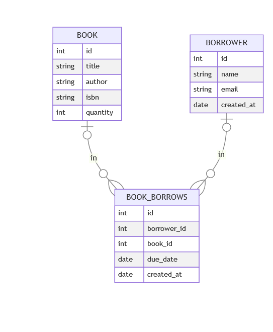
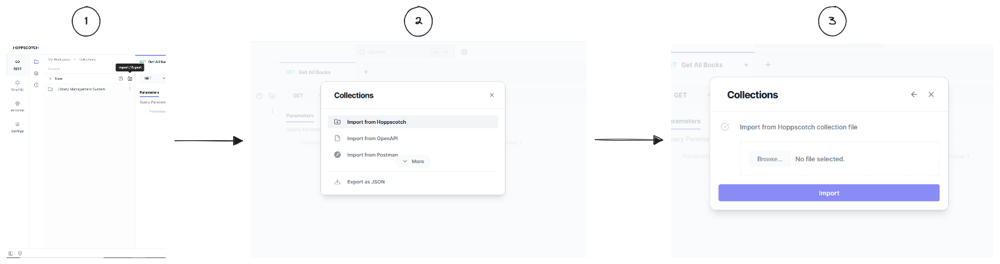
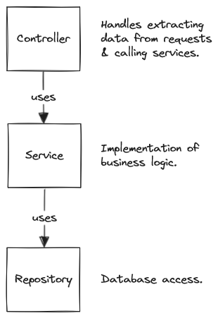

<!-- omit in toc -->
# Library Management System

This repository is the implementation of an API for a library management system. 

The API offers CRUD operations for management of books, borrowers & book borrowings.

- [Database Design](#database-design)
- [REST API Documentation](#rest-api-documentation)
- [Code Structure](#code-structure)
- [Usage Guide](#usage-guide)
  - [Prequisite Setup](#prequisite-setup)
  - [Environment Configuration](#environment-configuration)
  - [Scripts](#scripts)


## Database Design

The database consists of two main entities, books & borrowers. With a many-to-many relationship between them that represents book borrowings.

Used database is [PostgreSQL](https://www.postgresql.org/)



## REST API Documentation

The available endpoints are documented using a [Hoppscotch](https://hoppscotch.io/) collection.


To run the requests & interact with the collection. Download [library-api.json](./docs/library-api.json), and then follow the import steps in the picture.




## Code Structure

The code is organized to allow for ease of adding new features.



Dependencies are auto injected at runtime using [tsyringe](https://github.com/microsoft/tsyringe).

## Usage Guide

### Prequisite Setup

To setup prequisites you need to install `PostgreSQL`, follow the steps here for [Windows](https://www.postgresql.org/download/windows/) or [Linux](https://ubuntu.com/server/docs/databases-postgresql). After the installation is complete, create the database that will be used by the service.

`Node.js` is also needed, it can be installed from [nodejs.org](https://nodejs.org/en)

Now you're ready to follow the next steps.

### Environment Configuration

Create .env using from `.env.example` and populate the values for the created database name & user credentials.

### Scripts

Run the following `npm` commands to perform the necessary setup for running the service.

```
// Installs all dependencies
npm install

// Creates the tables in DB
npm run db:migrate

// Adds fake data for books and borrowers
npm run db:seed

// Start the service on the port defined in .env file
npm run start:dev

```

