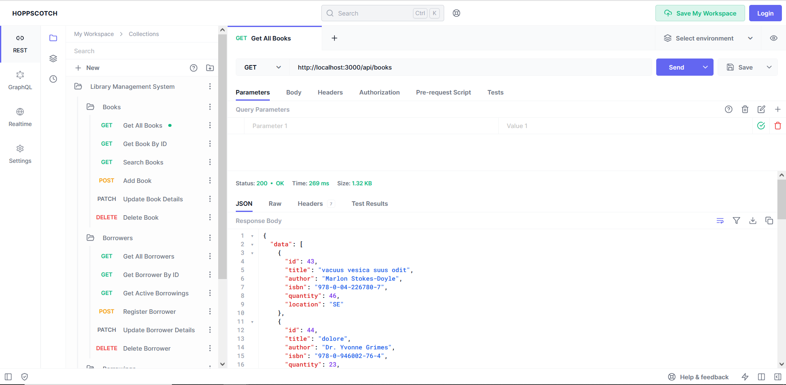

<!-- omit in toc -->
# Library Management System

This repository is the implementation of an API for a library management system. 

The API offers CRUD operations for management of books, borrowers & book borrowings.

- [Database Design](#database-design)
- [REST API Documentation](#rest-api-documentation)
  - [Endpoints](#endpoints)
  - [Collection](#collection)
- [Code Structure](#code-structure)
- [Usage Guide](#usage-guide)
  - [Prequisites](#prequisites)
  - [Environment Configuration](#environment-configuration)
  - [Scripts](#scripts)
- [Todo / Fixes](#todo--fixes)


## Database Design

The database consists of two main entities, books & borrowers. With a many-to-many relationship between them that represents book borrowings.

Used database is [PostgreSQL](https://www.postgresql.org/)


## REST API Documentation

### Endpoints

The API offers multiple endpoints to manage the library resources

| Endpoint                              | Description                                        |
|---------------------------------------|----------------------------------------------------|
| /GET/books                            | List all books                                     |
| /GET/books/{id}                       | Get book by ID                                     |
| /GET/books/search                     | Search books                                       |
| /POST/books                           | Add a new book                                     |
| /PATCH/books/{id}                     | Update book details                                |
| /DELETE/books/{id}                    | Delete book                                        |
| /GET/borrowers                        | List all borrowers                                 |
| /GET/borrowers/{id}                   | Get borrower by ID                                 |
| /GET/borrowers/{id}/active-borrowings | List all non returned book borrowings for borrower |
| /POST/borrowers                       | Add a new borrower                                 |
| /PATCH/borrowers/{id}                 | Update borrower details                            |
| /DELETE/borrowers/{id}                | Delete borrower                                    |
| /GET/borrowings                       | List all book borrowings                           |
| /GET/borrowings/overdue               | List all overdue book borrowings                   |
| /POST/borrowings                      | Create a new borrowing, checks out book            |
| /PATCH/borrowings/{id}/return         | Return book                                        |
| /DELETE/borrowings/{id}               | Delete borrowing                                   |


### Collection

All endpoints are available as a [Hoppscotch](https://hoppscotch.io/) collection.



To try the requests & interact with the collection. Download [library-api.json](./docs/library-api.json), and then follow the import steps in the picture.


## Code Structure

The code is organized to allow for ease of adding new features.

Dependencies are auto injected at runtime using [tsyringe](https://github.com/microsoft/tsyringe).


## Usage Guide

### Prequisites

To setup prequisites you need to install `PostgreSQL`, follow the steps here for [Windows](https://www.postgresql.org/download/windows/) or [Linux](https://ubuntu.com/server/docs/databases-postgresql). After the installation is complete, create the database that will be used by the service.

`Node.js` is also needed, it can be installed from [nodejs.org](https://nodejs.org/en)

Now you're ready to follow the next steps.

### Environment Configuration

Create .env using from `.env.example` and populate the values for the created database name & user credentials.

The resulting `.env` file will be similar to

```
PORT=3000

DB_TYPE=postgresql
DB_HOST=localhost
DB_USER=postgres
DB_PASSWORD=admin
DB_PORT=5432
DB_DATABASE=library_db
```

### Scripts

Run the following `npm` commands to perform the necessary setup for running the service.

```
// Installs all dependencies
npm install

// Creates the tables in DB
npm run db:migrate

// Adds fake data for books and borrowers
npm run db:seed

// Start the service on the port defined in .env file
npm run start:dev

```

## Todo / Fixes

- [ ] Add pagination to all GET endpoints that list resources
- [ ] Complete containerization of app
- [ ] Complete export functionality ( on branch `export`)